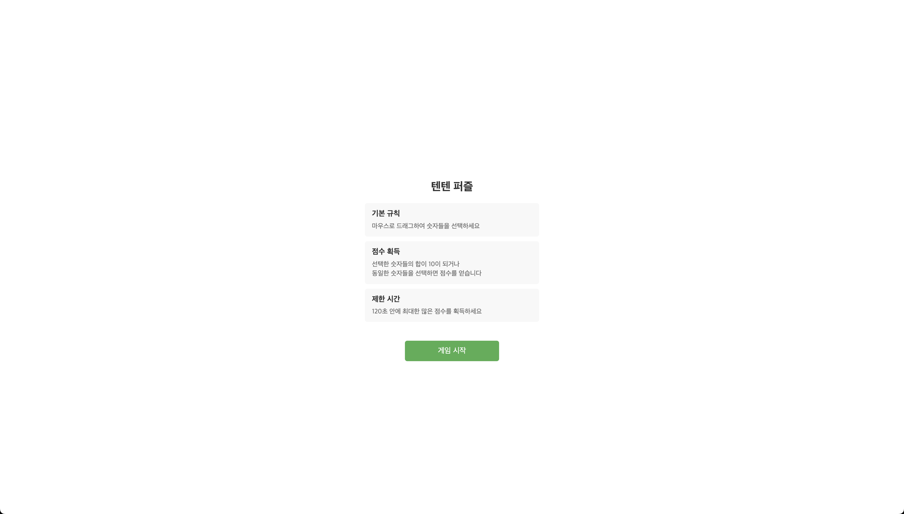

# 텐텐 퍼즐 (TenTen Puzzle)



## 🎮 게임 소개

텐텐 퍼즐은 숫자를 매칭하여 점수를 획득하는 캐주얼 퍼즐 게임입니다. 2분 동안 최대한 많은 점수를 획득하세요!

### 게임 규칙

1. **기본 규칙**: 마우스로 드래그하여 숫자들을 선택합니다
2. **점수 획득**:
   - 선택한 숫자들의 합이 10이 되거나
   - 동일한 숫자들을 선택하면 점수를 얻습니다
3. **제한 시간**: 120초 안에 최대한 많은 점수를 획득하세요

## 🎯 주요 기능

- 직관적인 드래그 앤 드롭 인터페이스
- 모바일 터치 스크린 지원
- BGM 및 볼륨 조절 기능
- 게임 설정 자동 저장
- 반응형 디자인

## 🛠️ 기술 스택

- TypeScript
- HTML5 Canvas
- CSS3
- Webpack
- ESLint & Prettier

## 🚀 플레이하기

[텐텐 퍼즐 게임 시작하기](https://tenten-puzzle.vercel.app/)

## 💻 로컬에서 실행하기

```bash
# 저장소 클론
git clone https://github.com/baekjungkim/tenten-puzzle.git

# 의존성 설치
npm install

# 개발 서버 실행
npm start

# 프로덕션 빌드
npm run build
```

## 📱 지원 브라우저

- Chrome (권장)
- Firefox
- Safari
- Edge
- 모바일 브라우저

## 🔄 업데이트 내역

### 버전 1.0.0 (2025-01-26)

- 최초 릴리즈
- 기본 게임 메커니즘 구현
- 모바일 지원 추가
- BGM 기능 추가

## 👥 기여하기

1. 이 저장소를 포크합니다
2. 새 브랜치를 생성합니다
3. 변경사항을 커밋합니다
4. 브랜치에 푸시합니다
5. Pull Request를 생성합니다

## 📝 라이선스

이 프로젝트는 MIT 라이선스로 배포됩니다. 자세한 내용은 [LICENSE](LICENSE) 파일을 참조하세요.

## 🔍 키워드

텐텐 퍼즐, 숫자 퍼즐, 브라우저 게임, 캐주얼 게임, 매칭 게임, 숫자 매칭, 사과 게임

---

© 2024 텐텐 퍼즐. All rights reserved.
